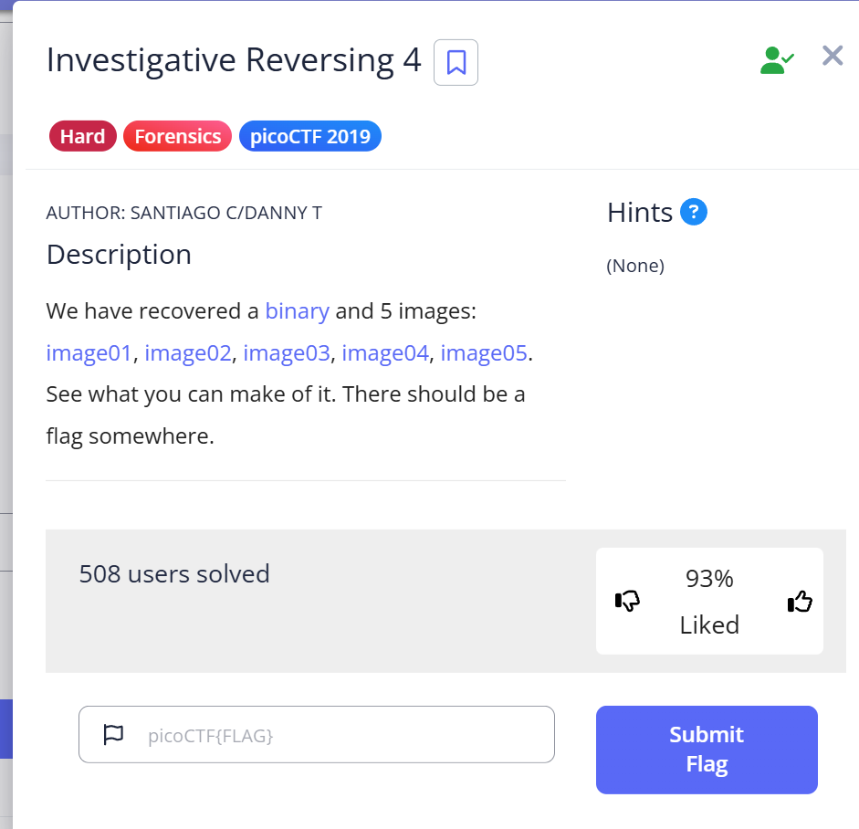
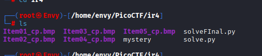
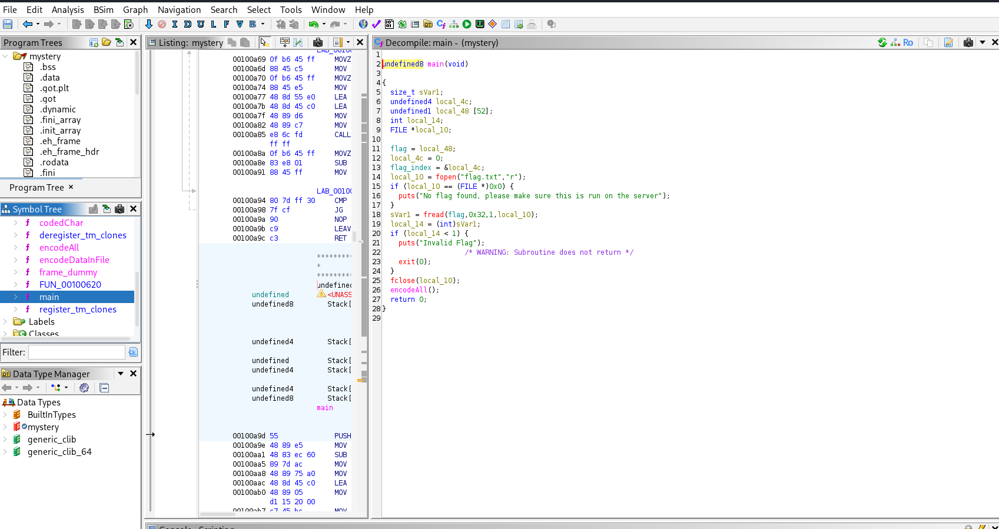
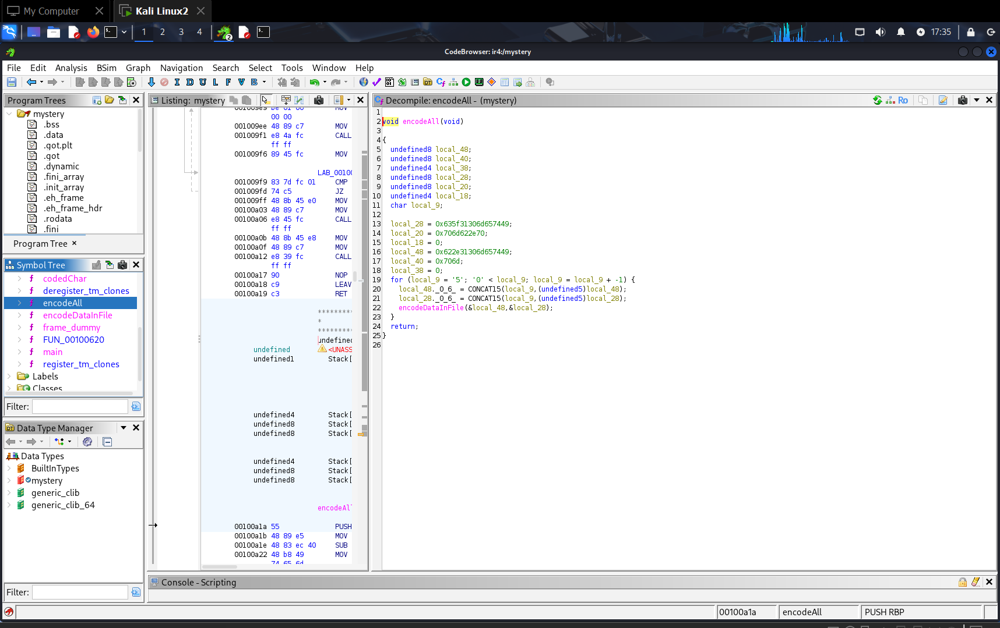
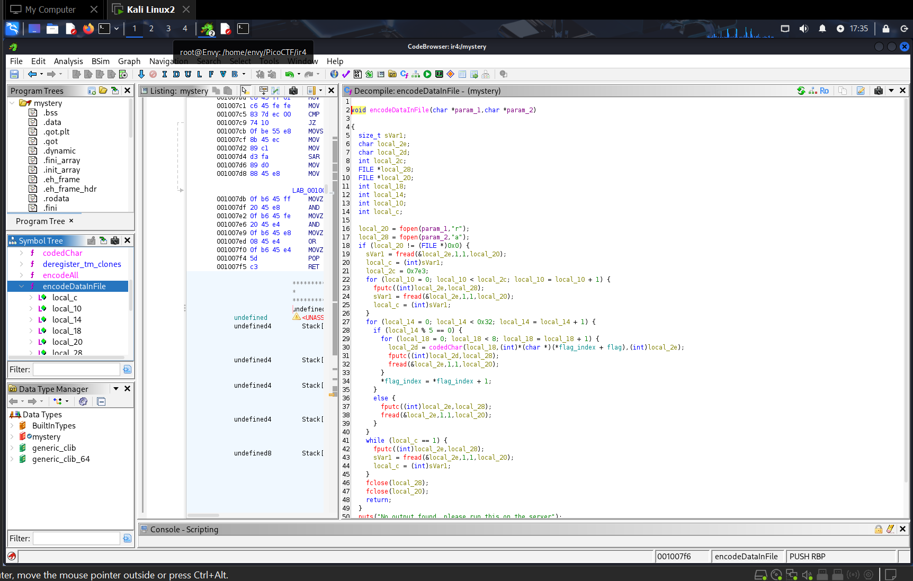

1. Informasi Tantangan
Kategori: Forensics

Deskripsi: Diberikan sebuah file biner (mystery) dan lima file gambar (image01 hingga image05). Tugasnya adalah menganalisis file-file ini untuk menemukan flag yang tersembunyi. (Sumber: soal.png)

2. Enumerasi Awal
Langkah pertama adalah melihat semua file yang diberikan. Dari ls di terminal, kita memiliki:

Lima file gambar: Item01_cp.bmp, Item02_cp.bmp, Item03_cp.bmp, Item04_cp.bmp, Item05_cp.bmp

Satu file biner: mystery

Karena ada file biner yang dieksekusi, fokus utama investigasi adalah melakukan reverse engineering pada file mystery untuk memahami bagaimana ia berinteraksi dengan kelima gambar tersebut. (Sumber: clue.png)

3. Analisis Biner & Reverse Engineering
Dengan menggunakan Ghidra, logika internal program mystery berhasil dibedah dalam tiga tahap:

a. Fungsi main() Analisis pada fungsi main menunjukkan bahwa program ini adalah sebuah enkoder. Ia dirancang untuk membaca sebuah flag dari file flag.txt (yang ada di server), lalu memanggil fungsi encodeAll() untuk memulai proses penyembunyian data. 

b. Fungsi encodeAll() Fungsi ini berisi logika kunci pertama: sebuah loop yang berjalan mundur dari 5 ke 1. Ini berarti program memproses file gambar dalam urutan terbalik: Item05, Item04, Item03, Item02, lalu Item01. Di setiap iterasi, ia memanggil encodeDataInFile() untuk melakukan enkripsi pada satu gambar. 

c. Fungsi encodeDataInFile() Ini adalah inti dari mekanisme steganografi. Analisis pada fungsi ini mengungkap dua detail penting:

Header Offset: Program akan melewati 2019 byte (0x7e3) pertama dari setiap gambar sebelum menyisipkan data.

Pola Enkripsi: Program menyembunyikan 10 karakter flag per gambar dengan pola LSB (Least Significant Bit) yang unik: sembunyikan 1 karakter dalam 8 byte, lalu salin 4 byte biasa. (Sumber: encodeDataInFile.jpg)

4. Skrip Solusi
Dengan semua informasi di atas, kita dapat membuat skrip Python untuk membalik proses tersebut. Skrip harus:

Membaca file gambar dalam urutan terbalik (dari 5 ke 1).

Melewati 2019 byte pertama dari setiap file.

Mengekstrak 10 karakter dari setiap file dengan pola "baca 8 byte, lewati 4 byte".

Menggabungkan hasilnya untuk membentuk flag lengkap.
Python

# solveFinal.py
import base64

def solve():
    # Daftar file dalam urutan yang benar (mundur)
    files = [
        "Item05_cp.bmp",
        "Item04_cp.bmp",
        "Item03_cp.bmp",
        "Item02_cp.bmp",
        "Item01_cp.bmp"
    ]

    full_flag = ""
    
    for filename in files:
        print(f"[*] Processing {filename}...")
        with open(filename, 'rb') as f:
            # Lewati header BMP sebesar 2019 byte
            f.seek(2019)

            # Setiap file menyembunyikan 10 karakter
            for _ in range(10):
                char_byte = 0
                
                # Rekonstruksi 1 karakter dari 8 byte gambar
                for _ in range(8):
                    img_byte = f.read(1)
                    if not img_byte:
                        raise EOFError("File ended unexpectedly.")
                    
                    lsb = ord(img_byte) & 1
                    char_byte = (char_byte << 1) | lsb
                
                # Balik urutan bit dan konversi ke karakter
                full_flag += chr(int(bin(char_byte)[2:].zfill(8)[::-1], 2))

                # Lewati 4 byte sesuai dengan pola enkoder
                f.read(4)

    print("\n[+] Flag ditemukan!")
    print(full_flag)

if __name__ == '__main__':
    solve()
5. Eksekusi dan Flag
Menjalankan skrip solveFinal.py berhasil memproses semua file dalam urutan yang benar dan mengekstrak flag yang tersembunyi.

Flag: picoCTF{N1c3_R3ver51ng_5k1115_0000000000b93ee6e2}